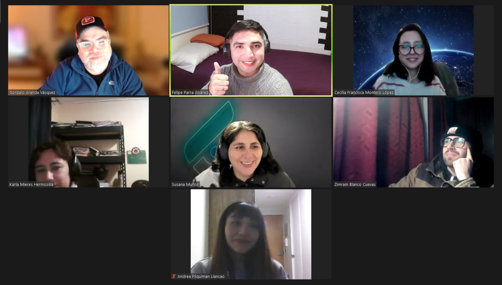

# Trabajo Grupal 6 Modulo 6 [](https://github.com/33fparra)

Contents
========

 * [Descripción del Proyecto](#descripción-del-proyecto-memo)
 * [Instrucciones de Instalación](#instrucciones-de-instalación-computer)
 * [Funcionalidades](#funcionalidades-sparkles)
 * [Participantes del Grupo](#participantes-del-grupo-busts_in_silhouette)
 
## Descripción del Proyecto :memo:

📝 La empresa Spam Economy Spa se dedica a ofrecer el servicio de notificaciones de los indicadores
económicos y está abriendo una sucursal en Chile, por lo que necesita un desarrollador que programe un
servidor que reciba una lista de correos electrónicos, a los cuales se les enviará periódicamente correos
electrónicos personalizados con los indicadores del dólar, euro, uf y utm.
Deberás desarrollar un servidor que al ser consultado devuelva un sitio web que encontrarás en el Apoyo
Desafío - Spam Economy Spa. En la siguiente imagen verás el formulario disponible en el HTML de apoyo,
el cual cuenta con 3 campos: Correos destino, asunto y mensaje.
El objetivo del desafío es lograr enviarles un correo electrónico a diferentes direcciones separadas por “,”
en el campo “correos” del formulario. Además de concatenarle al mensaje escrito los indicadores
económicos mencionados al inicio de la descripción de este desafío.

1. Usar el paquete nodemailer para el envío de correos electrónicos.
2. Crear una función que reciba la lista de correos, asunto y contenido a enviar. Esta función debe
retornar una promesa.
3. Realizar una petición a la api de mindicador.cl y preparar un template que incluya los valores del
dólar, euro, uf y utm. Este template debe ser concatenado al mensaje descrito por el usuario en el
formulario HTML.
4. Enviar un mensaje de éxito o error por cada intento de envío de correos electrónicos.
5. Cada correo debe ser almacenado como un archivo con un nombre identificador único en una
carpeta “correos”. Usar el paquete UUID para esto.


## Instrucciones de Instalación :computer:

⚙️ Para instalar las dependencias necesarias, sigue los siguientes pasos:

1. Clona el repositorio en tu máquina local.
2. Abre una terminal y navega hasta la carpeta del proyecto.
3. Ejecuta el siguiente comando para instalar las dependencias:

   npm install

4. Abrir el archivo html ingresando al https://localhost:3000
5. Llenar el formulario y enviar
6. No olvides cambiar el user y el pass de la funcion que envia los correos por nodemailer, siguieno el siguiente tutorial: https://www.youtube.com/watch?v=KjheexBLY4A

<details><summary><b>Ver las instrucciones</b></summary>

1. Instalar las dependencias:

   ```sh
   npm install
   ```

2. En el caso de no poder instalar las dependencias:

   ```sh
   npm install --force
   ```

3. Las librerias que estamos ocupando `package.json`:

    ````sh
    ... 
    "name": "helpers",
    "version": "1.0.0",
    "description": "",
    "main": "index.js",
    + "type": "module",
    "scripts": {
    "test": "echo \"Error: no test specified\" && exit 1"
    },
    "author": "",
    "license": "ISC",
    "dependencies": {
    "body-parse": "^0.1.0",
    "express": "^4.18.2",
    "hbs": "^4.2.0",
    +"nodemailer": "^6.9.4",
    "path": "^0.12.7"
    }
    ````

 
</details>

## Funcionalidades :sparkles:

✨ Con nuestra aplicacion puedes:

1. Funcionalidad : En viar correo utilizando la libreria Nodemailer




## Participantes del Grupo :busts_in_silhouette:

1. Cecilia Montero : https://github.com/cmonlop

2. Karla Mieres : https://github.com/karlamieres

3. Zimram Blanco : https://github.com/Zimram

4. Andrea Pilquiman : https://github.com/AndreaPLL

5. Gonzalo Aranda : https://github.com/gonzaloaranda

6. Felipe Andres Parra : https://github.com/33fparra

### Este proyecto está bajo la licencia MIT. Para más información, consulta el archivo LICENSE.


## Grupo Verde (https://github.com/33fparra/Ejercicio_grupal_6.6_nodemailer)

